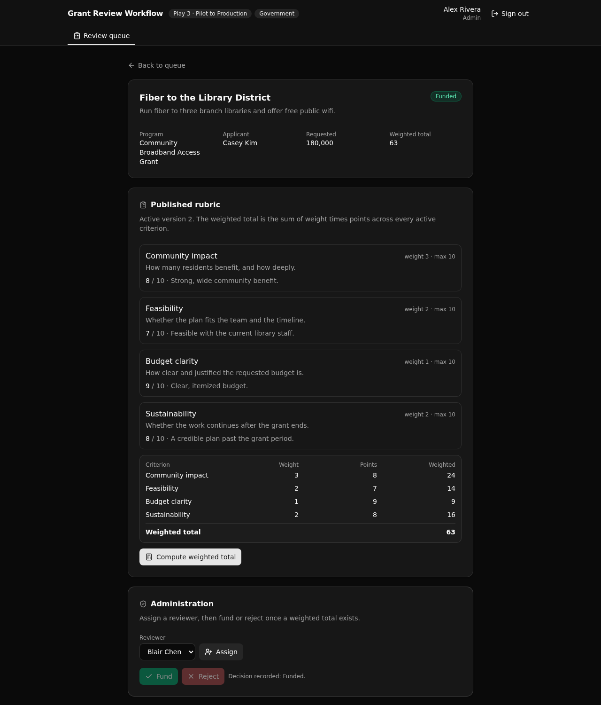

# Grant Review Workflow

A governed backend for a public grant program, where every application is validated on intake, assigned to a reviewer, scored against a published versioned rubric, and written to an audit trail.

It is the control layer that makes an AI-built grant intake tool safe to run in production. The business rules (who can do what, what a valid submission is, how a score becomes a decision) live in one readable Xano API layer a technical reviewer can point at and trust.



## What it demonstrates

- **Play:** Pilot to Production (Play 3). The governed backend under a plausible AI-generated internal tool.
- **Vertical:** government. A public agency running a grant program.
- **The one governed job:** scoring. Reviewers grade an application against a published, versioned rubric, and the API computes a weighted total (the sum of weight times points) that no client can fake.

Why an evaluator cares: speed is not the differentiator, control is. This app keeps intake validation, API-layer role based access control, versioned criteria, and a full audit trail in one place a human can read and approve.

**7 tables · 13 endpoints · 1 pinned API group.** Native `@xanots/sdk` auth (an auth table, `create_auth_token`, and per-endpoint role guards). No add-ons, no external credentials, runs entirely on seed data.

## Repo layout

```
xano/
  index.ts              the workspace, registering everything
  tables/*.ts           7 tables (users, programs, criteria, applications, assignments, scores, events)
  api/*.ts              13 endpoints, one API group with a pinned canonical slug ("grant")
  lib/                  shared domain vocabulary + the RBAC and audit helpers
frontend/
  src/lib/api.ts        the one contract: paths and types derived from the query defs
  src/screens/*         sign in, submit, review queue, application detail + scoring
docs/                   the landing page + screenshot (served by GitHub Pages)
```

## API surface

Every endpoint is served under the pinned canonical, so paths are stable: `/api:grant/<name>`.

| Verb | Path | What it enforces |
| ---- | ---- | ---------------- |
| POST | `auth/signup` | Registers an applicant. Email is unique, role is fixed to applicant server-side. |
| POST | `auth/login` | Verifies credentials, returns a bearer token. |
| GET  | `programs/list` | Programs any signed-in user can browse. |
| POST | `applications/submit` | Applicant only. Intake validation: the program is open, the deadline has not passed, the amount is positive and within the funding cap. |
| GET  | `applications/queue` | Reviewer or admin. A reviewer sees only assigned applications, an admin sees all, filterable by status. |
| GET  | `applications/detail/{id}` | Reviewer or admin. One application with its rubric, scores, and full audit trail. |
| POST | `applications/assign` | Admin only. The assignee must hold the reviewer role, and cannot be assigned twice. |
| POST | `scores/record` | Reviewer only, and only for an assigned application. Points are bounded by the criterion maximum. |
| POST | `applications/compute-score` | Weighted total over the active rubric. It refuses until every active criterion has a score. |
| POST | `applications/decide` | Admin only. Fund or reject, only after a weighted total exists. |
| GET  | `criteria/list` | The active versioned rubric for a program. |
| GET  | `users/reviewers` | Admin only. Reviewers for the assign control. |
| POST | `seed/run` | Idempotent reset and reseed of the demo data. |

Access is controlled at the API layer with role based access control (a role check inside each endpoint), never row-level security.

## Quick start

Go from clone to a live backend and frontend in about a minute.

```bash
git clone https://github.com/xano-scratch/grant-review-workflow
cd grant-review-workflow
npm install
npx xanots login          # authenticate once
npm run xano:deploy        # builds the frontend, deploys both, prints the live URL
```

Open the printed URL and sign in with a seeded account. The app also self-seeds on first load, so the demo data is there without any manual setup.

Seeded accounts (password is the role plus `-demo`):

| Role | Email | Sees |
| ---- | ----- | ---- |
| Applicant | `casey.kim@example.org` | Submit an application, with live intake validation |
| Reviewer | `blair.chen@agency.gov` | Score an assigned application against the rubric |
| Admin | `alex.rivera@agency.gov` | Assign reviewers, compute totals, fund or reject |

## How the scoring works

A program publishes a versioned rubric. Only the rows marked active form the rubric a reviewer scores against, so an older version stays on record and is never overwritten. A reviewer records points for each active criterion, bounded by that criterion's maximum. When every active criterion is scored, `compute-score` sums weight times points across the rubric and writes the weighted total. In the seeded demo, points of 8, 7, 9, and 8 against weights of 3, 2, 1, and 2 produce a total of 63. The application can then be funded or rejected, and every step is recorded in the audit trail.

## FAQ

**Where is the business logic?** In the Xano API layer, authored in TypeScript under `xano/`. It is readable, typed, and versioned, so a reviewer can approve it before it ships.

**How is access controlled?** With API-layer role based access control. Each protected endpoint loads the caller and checks their role. There is no row-level security here.

**Do I need any credentials or external services?** No. It runs on seed data, so a fresh deploy is browsable right away.

**How does the frontend stay in sync with the backend?** It derives every request path and every request and response type from the query defs (`frontend/src/lib/api.ts`). Change an endpoint and the frontend types follow, so a drift is a compile error, not a runtime surprise.

## xano.lock

`xano/xano.lock` is committed on purpose. It pins each object's identity and the public URL token, so a later rename stays a rename instead of a delete and recreate. Every build writes it.

## License

MIT. See [LICENSE](LICENSE).
